# task_management_app

A new Flutter project.

https://github.com/Md-Sifatullah617/task_management_app/assets/71620908/ead78dbf-f77b-488c-931a-61cc1d960de4

<!-- short the video player size -->
<video width="320" height="240" controls>
  <source src="https://github.com/Md-Sifatullah617/task_management_app/assets/71620908/ead78dbf-f77b-488c-931a-61cc1d960de4" type="video/mp4">

###screenshot

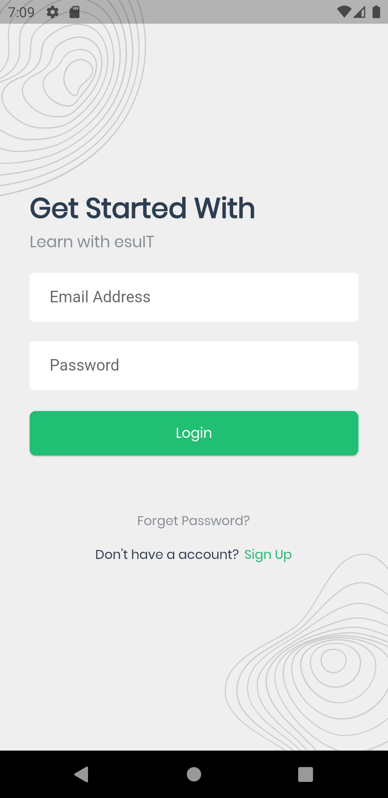
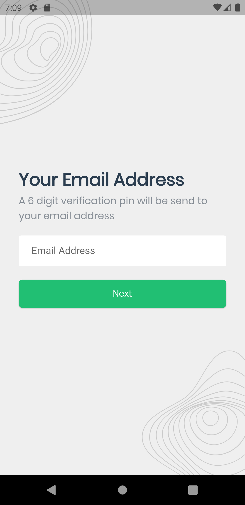
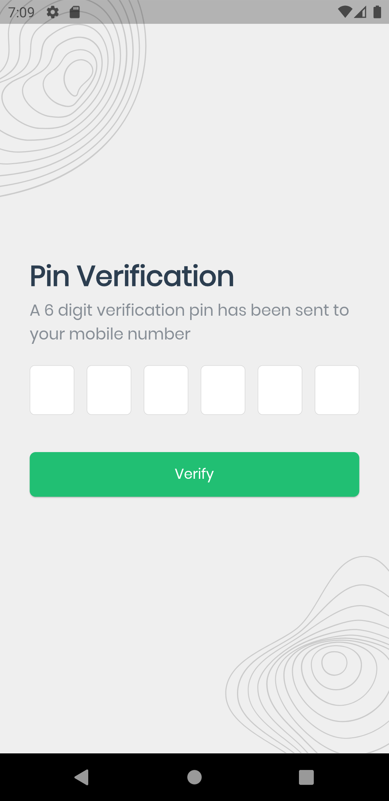

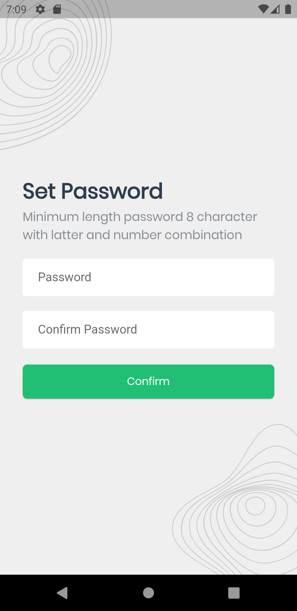
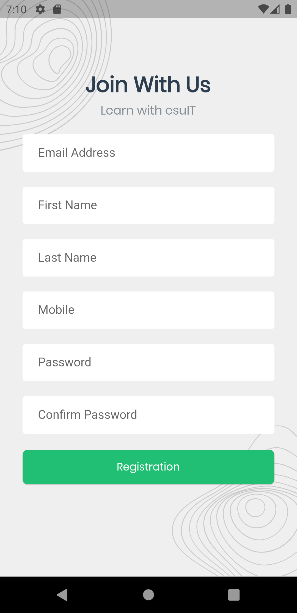

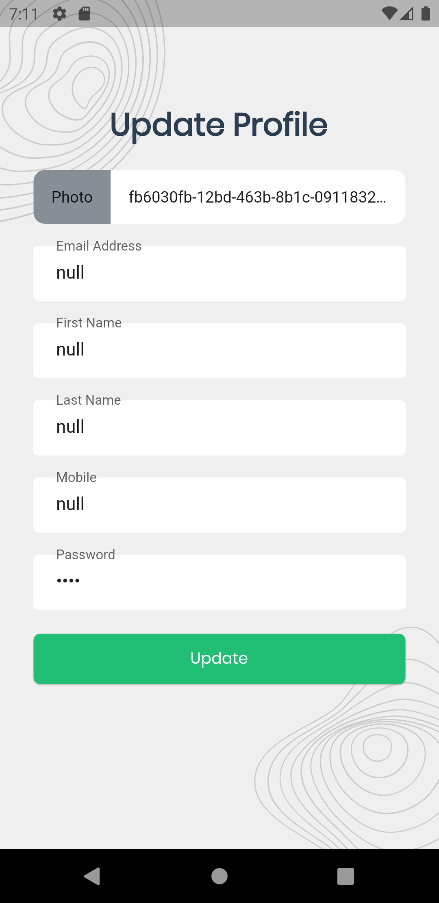
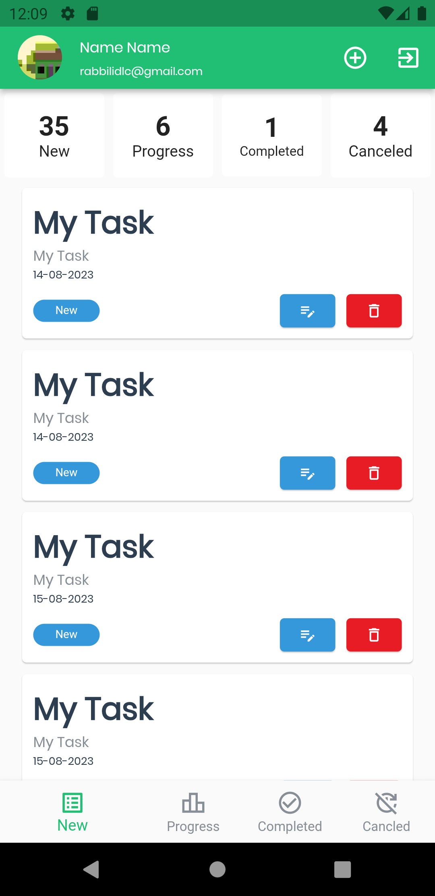
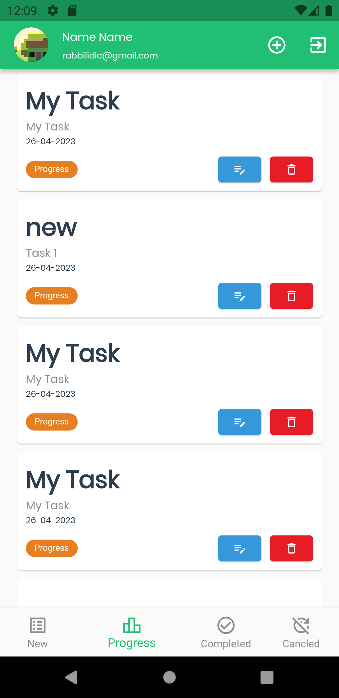

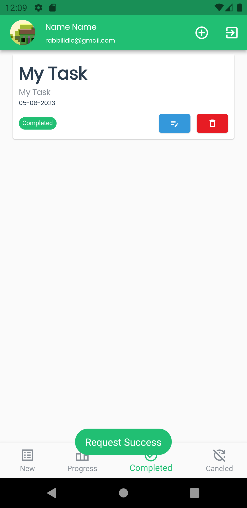
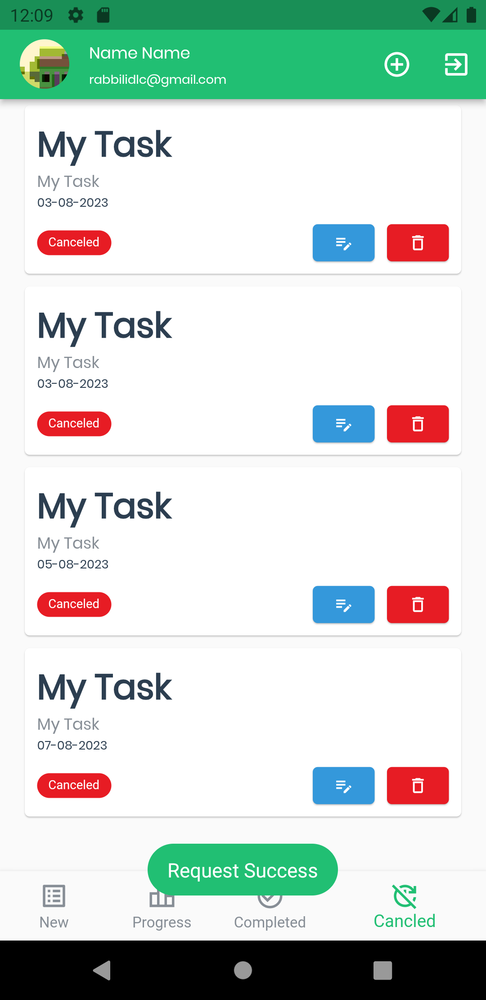
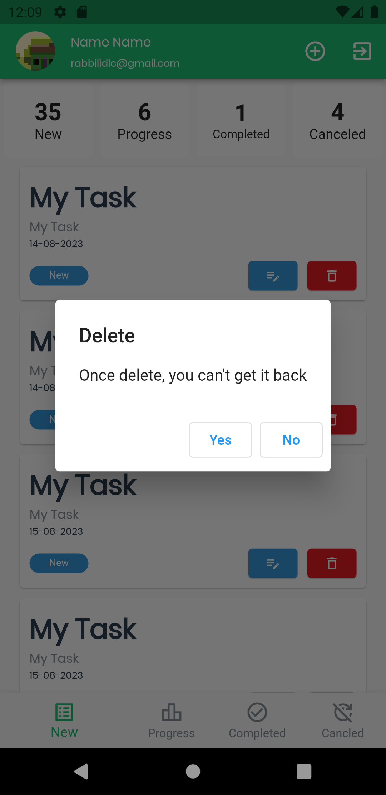

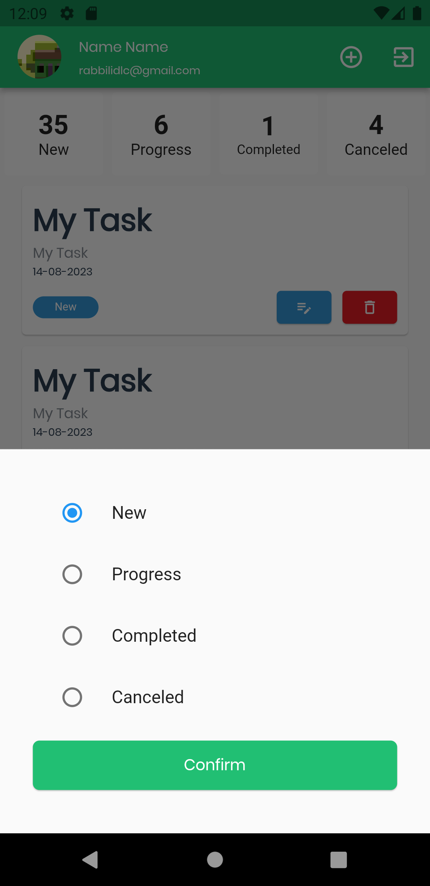

